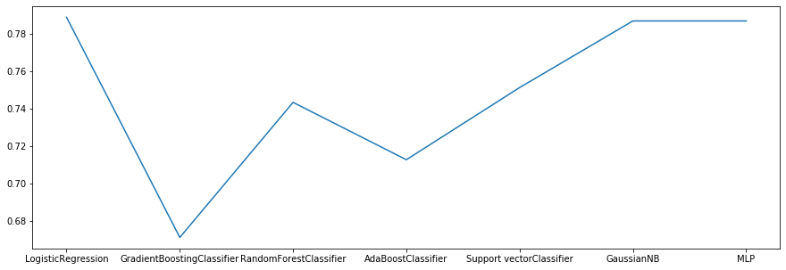

# Santander-Customer-Transaction-Prediction
Santander Customer Transaction Predict with Machine Learning models in Python.

[More info](https://www.kaggle.com/competitions/santander-customer-transaction-prediction/overview)

## Segue os modelos de machine learning utilizados neste notebook e os respectivos resultados da acurácia após o treinamento:
* GradientBoostingClassifier -> 67%
* RandomForestClassifier -> 74%
* KNeighborsClassifier -> 67%
* AdaBoostClassifier -> 71%
* LogisticRegression -> 79%
* MLPClassifier -> 79%
* GaussianNB -> 79%
* SVC -> 75%

