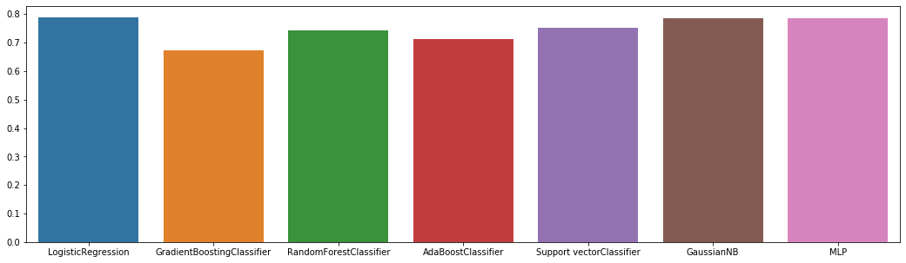

# Santander customer transaction prediction
O objetivo dessa analise é dentificar quais clientes farão uma transação específica no futuro, independentemente da quantidade de dinheiro transacionada. 

[More info](https://www.kaggle.com/competitions/santander-customer-transaction-prediction/overview)

## Modelos de machine learning utilizados e seus respectivos resultados da acurácia após o treinamento:
* GradientBoostingClassifier -> 67%
* RandomForestClassifier -> 74%
* KNeighborsClassifier -> 67%
* AdaBoostClassifier -> 71%
* LogisticRegression -> 79%
* MLPClassifier -> 79%
* GaussianNB -> 79%
* SVC -> 75%

